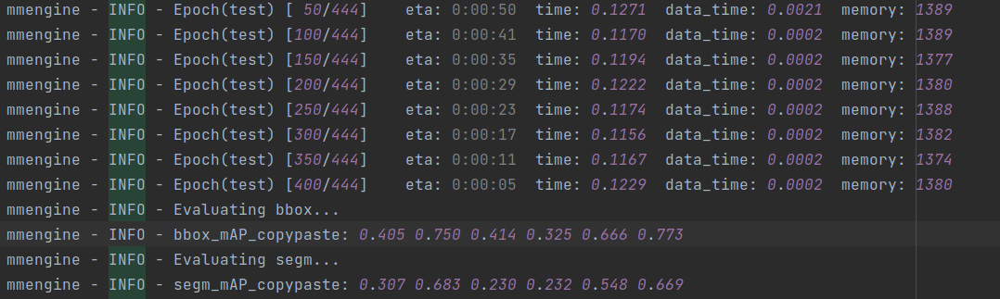
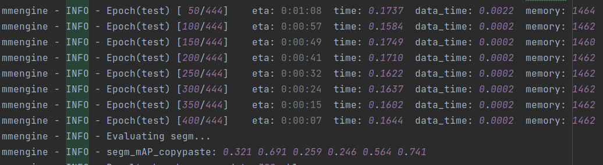

## Enhanced BoxInst for weakly Supervised Liver Tumor Instance Segmentation


## Training
Configs can be trained with:
```bash
python tools/train.py /path/to/your/config 
```

## Evaluation
Model evaluation can be done as follows:
```bash
python tools/test.py ${CONFIG_FILE} ${CHECKPOINT_FILE} [--out ${RESULT_FILE}] [--eval ${EVAL_METRICS}] [--show] [--show-dir ${SHOW_DIR}]
```
## Results on resnet50
<div align="center">
  
</div>

## Results on resnet101
<div align="center">
  
</div>
